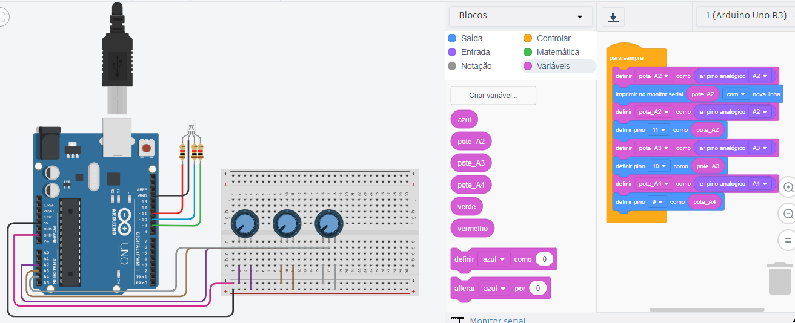

# Pensamento-Computacional

Inicialmente foi montado toda a estrutura composta por um arduino, uma placa de ensaio, fios, três resitores, três potenciômetros e um led rgb para que houvesse a funcionalidade solicitada.
Em seguida foi criada as variáveis "pote_A2", "pote_A3" e "pote_A4".
Posteriormente a variáveis foram definidas como pino analógicos.
Após essa sequência, quando acionamos o potenciômetro 1 ele ativa a cor vermelha do lgb, quando acionamos o potenciômetro 2 ele ativa a cor azul do lgb e por fim acionamos o potenciômetro 3 ele ativa a cor verde lgb, entregando assim funcionalidade inicialmente solicitada. 

