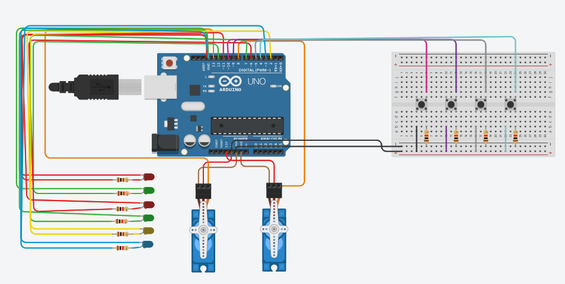
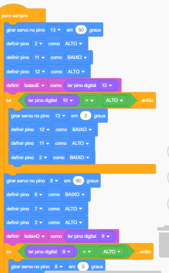
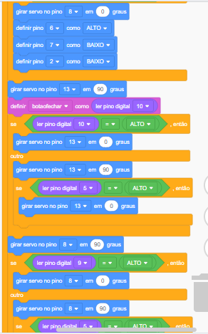

Inicialmente foi montada uma estrutura composta por 1 arduino, 4 botões, 6 leds, 1 placa de ensaio, 6 resistores e 2 servos motores para que houvesse a funcionalidade solicitada.

Em seguida foram criadas as variáveis "botaoE", "botaoD", "botaofechar" e "botaodoislados", posteriormente as variáveis foram definidas nos pinos, após a criação das variáveis foi estruturado todo o circuito.

Após essa sequência, quando iniciamos a simulação o primeiro led vermelho acende, quando acionamos o botão 1 abre apenas o lado esquerdo e acender o primeiro led verde, quando acionamos o botão 2 abre apenas o lado direito e acende o segundo led verde, antes dessa ação acende-se, quando acionamos o botão 3 fecha ambos os lados do portão e acende os leds vermelhos e por fim, quando acionamos o botão 4 o portão fica completamente aberto, acendendo assim o led azul. Saliento que durante toda e qualquer movimentação dos portões o led amarelo acende.

 

